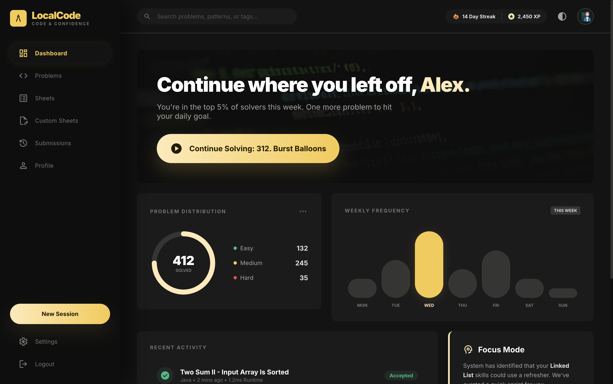
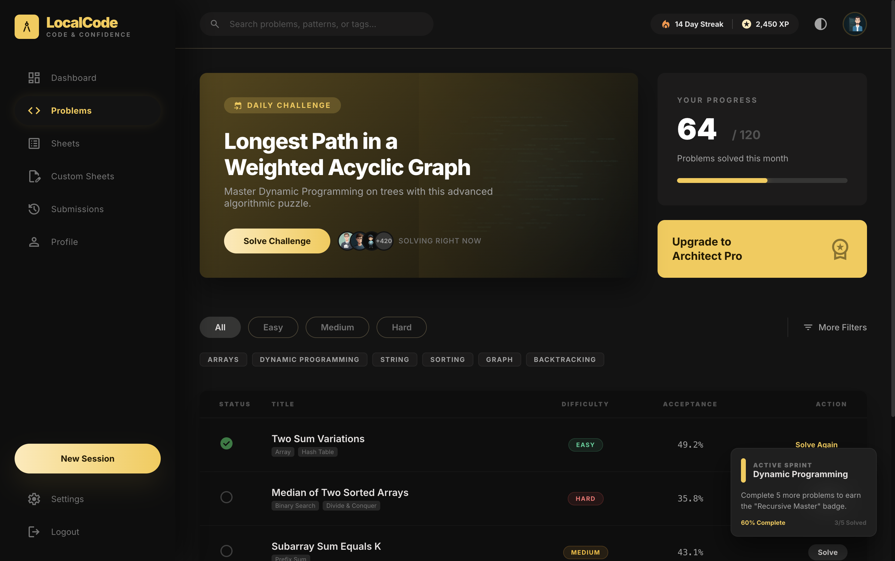
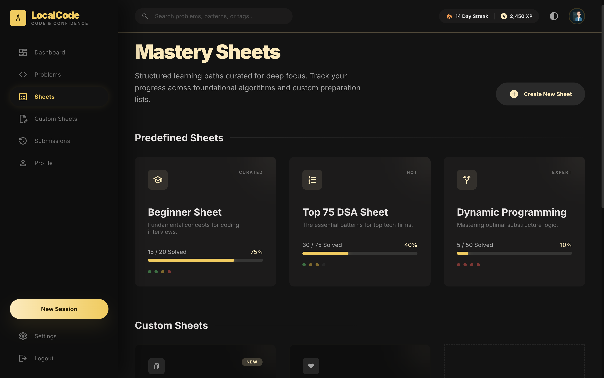

# 🚀 LocalCode Pro

<p align="center">
  
</p>

---

## 🧠 About the Project

💡 **LocalCode Pro** is an **offline-first DSA practice platform** inspired by LeetCode.
It allows developers to **practice Data Structures & Algorithms anytime, anywhere — even without internet access**.

---

## ✨ Features

* 🧠 Offline DSA Practice
* 📊 Interactive Dashboard Analytics
* 📚 Structured Problem Sheets
* 🛠️ Create Custom Sheets
* 📈 Submission History Tracking
* 👤 Profile with Stats & Heatmaps
* ⚡ Fast Desktop Experience (Electron)

---

## 🖼️ Screenshots

<table align="center">
  <tr>
    <td align="center">
      <b>📊 Dashboard</b><br/>
      
    </td>
    <td align="center">
      <b>💻 Problems</b><br/>
      
    </td>
  </tr>
  <tr>
    <td align="center">
      <b>📄 Sheets</b><br/>
      
    </td>
    <td align="center">
      <b>👤 Profile</b><br/>
      
    </td>
  </tr>
</table>

---

## 🏗️ Tech Stack

<p align="center">
  
</p>

---

## ⚙️ Installation

```bash id="inst01"
git clone https://github.com/your-username/LocalCode.git
cd LocalCode
npm install
npm run dev
```

---

## 🚀 Future Enhancements

* 🌐 Cloud Sync
* 🔐 Authentication System

---

## 🔗 Connect

<p align="center">
  🚀 Open to collaboration, feedback, and new opportunities  
</p>

<p align="center">

<a href="https://www.linkedin.com/in/priyanshu-roushan">
  
</a>

<a href="mailto:priyanshuroushan01@gmail.com">
  
</a>

</p>


